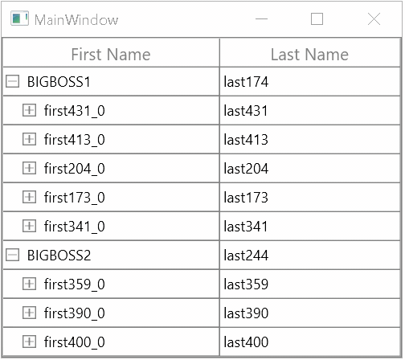

# How to Expand or Collapse the WPF TreeGrid by Clicking Any Cell in the Row?

This sample illustrate about how to expand or collapse the [WPF TreeGrid](https://www.syncfusion.com/wpf-controls/treegrid) (SfTreeGrid) by clicking any cell in the row.

You can expand or collapse the groups by click any cell in caption summary row by overriding [ProcessOnTapped](https://help.syncfusion.com/cr/wpf/Syncfusion.UI.Xaml.TreeGrid.TreeGridRowSelectionController.html#Syncfusion_UI_Xaml_TreeGrid_TreeGridRowSelectionController_ProcessOnTapped_System_Windows_Input_MouseButtonEventArgs_Syncfusion_UI_Xaml_ScrollAxis_RowColumnIndex_) method in [TreeGridRowSelectionController](https://help.syncfusion.com/cr/wpf/Syncfusion.UI.Xaml.TreeGrid.TreeGridRowSelectionController.html) of `TreeGrid`.

```c#
this.treeGrid.SelectionController = new TreeGridSelectionControllerExt(this.treeGrid);

public class TreeGridSelectionControllerExt : TreeGridRowSelectionController
{
    public TreeGridSelectionControllerExt(SfTreeGrid treeGrid) : base(treeGrid)
    {
    }

    protected override void ProcessOnTapped(MouseButtonEventArgs e, RowColumnIndex currentRowColumnIndex)
    {
        if (currentRowColumnIndex.RowIndex <= this.TreeGrid.GetHeaderIndex())
            return;

        var node = TreeGrid.GetNodeAtRowIndex(currentRowColumnIndex.RowIndex);
        if (node != null)
        {
            if (node.IsExpanded)
                TreeGrid.CollapseNode(node);
            else if (!node.IsExpanded)
                TreeGrid.ExpandNode(node);
        }
        base.ProcessOnTapped(e, currentRowColumnIndex);
    }
}
```

